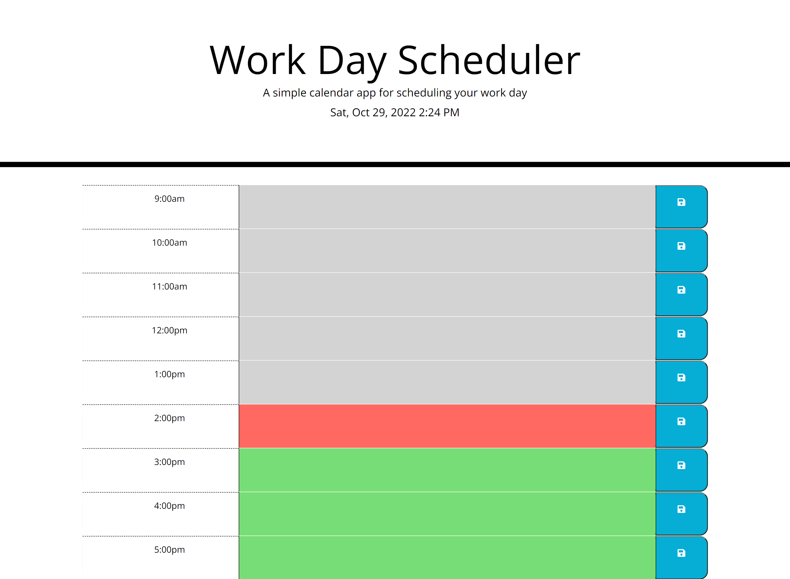

# Daily Planner

## Description

This repository is where I created a simple calendar application that allows a user to save events for each hour of the work day. 

## Installation

N/A

## Usage

[Deployed website] (https://mmmatson.github.io/daily-planner/)

The current day is displayed at the top of the calendar and there are timeblocks for standard business hours. Each timeblock is color coded to indicate whether it is in the past, present, or future. Click into a timeblock to enter an event, then click the save button for that timeblock. Clicking the save button will save the text for the event in local storage.

## Credits

[Repository with starter code] (https://nu.bootcampcontent.com/NU-Coding-Bootcamp/NU-VIRT-FSF-PT-09-2022-U-LOLC/-/tree/main/)

## License

See repository for license information.